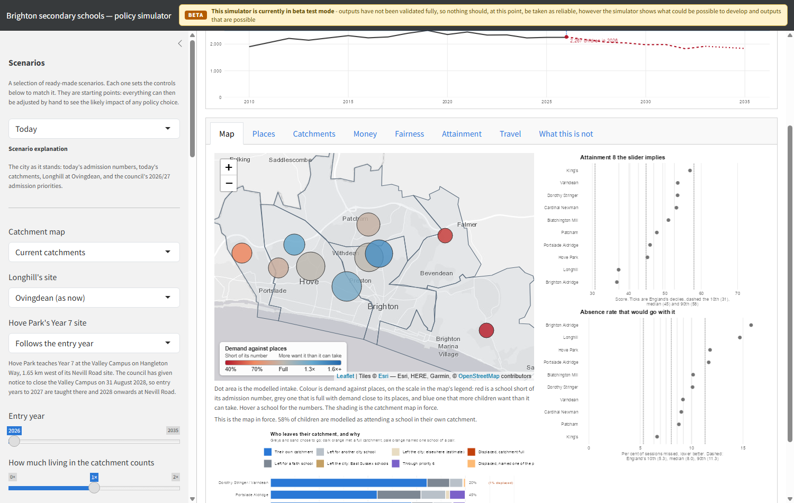

```{r setup}
#| include: false
# Two sources, one deck.
#  - The attainment evidence: this repository (How to Pull the Right Lever),
#    read from its cached model fits.
#  - The city system: the bh-school-system repository (the strategic view,
#    the model guide and the simulator), read from its assembled data.

# ---- The city system -------------------------------------------------
BHS <- "E:/bh_school_system"
# 00_core.R takes its root from here::here(), which is this repository
# when the deck renders, so it is evaluated with the root swapped in.
core <- readLines(file.path(BHS, "R", "00_core.R"), encoding = "UTF-8", warn = FALSE)
eval(parse(text = sub("here::here()", "BHS", core, fixed = TRUE), encoding = "UTF-8"))
source(file.path(BHS, "app", "R", "model.R"))
source(file.path(BHS, "app", "R", "outcomes.R"))

suppressPackageStartupMessages({
  library(lme4); library(knitr); library(kableExtra); library(scales)
  library(ggrepel); library(patchwork)
})
knitr::opts_chunk$set(dev = "ragg_png", dpi = 150, dev.args = list(bg = "#FAFAFA"))

inp   <- readRDS(file.path(BHS, "app", "data", "sim_inputs.rds"))
cop   <- bh_data("council_options.rds")
whx   <- bh_data("whitehawk_explained.rds")
acc   <- bh_data("accessibility.rds")
oi    <- bh_data("open_inputs.rds")
os    <- bh_data("open_scenarios.rds")
fpan  <- bh_data("factsheet_panel.rds")
rc    <- bh_data("reception_cohort.rds")
sfin  <- bh_data("school_finance.rds")
mt    <- bh_data("model_terms.rds")
lsoa  <- bh_data("lsoa.geojson") |> sf::st_transform(4326)
catch <- bh_data("catchments_current.geojson") |> sf::st_transform(4326)
sch   <- schools_sf(oi$schools) |> dplyr::filter(name != "Peacehaven Community School")
elm_pt <- sf::st_as_sf(data.frame(e = oi$elm_grove$easting, n = oi$elm_grove$northing),
                       coords = c("e", "n"), crs = 27700) |> sf::st_transform(4326)
CITY_X <- c(-0.25, -0.01); CITY_Y <- c(50.80, 50.885)

co  <- function(id, col, y = 2030) cop$runs[[col]][cop$runs$id == id & cop$runs$year == y]
whe <- function(id, col, y = 2026)
  cop$whitehawk_elm[[col]][cop$whitehawk_elm$id == id & cop$whitehawk_elm$year == y]
city   <- inp$schools[inp$schools$city & !(inp$schools$hypothetical %in% TRUE), ]
places <- sum(city$pan)
kids   <- function(y) inp$demand$cohort[inp$demand$year == y]
no30   <- acc$lsoa[acc$lsoa$places_30 < 1, ]
fmt_pct <- function(x, d = 0) paste0(formatC(x, format = "f", digits = d), "%")
gbp_m   <- function(x) sprintf("%s£%.1fm", ifelse(x < 0, "−", ""), abs(x) / 1e6)
ordinal <- function(n) paste0(n, ifelse(n %% 100 %in% 11:13, "th",
                                c("th", "st", "nd", "rd", rep("th", 6))[n %% 10 + 1]))

INK <- "#1f3b57"; MUTED <- "#6b7785"; ACCENT <- "#2a78d6"; WARM <- "#d95f02"; BAD <- "#b2182b"
PURPLE <- "#3A1857"; PINK <- "#ED357D"
theme_bhs <- function(base = 16)
  ggplot2::theme_minimal(base) +
  ggplot2::theme(panel.grid.major.y = ggplot2::element_blank(),
                 panel.grid.minor = ggplot2::element_blank(),
                 plot.title = ggplot2::element_text(face = "bold", colour = PURPLE),
                 plot.subtitle = ggplot2::element_text(colour = MUTED),
                 plot.title.position = "plot",
                 axis.text = ggplot2::element_text(colour = INK),
                 plot.background = ggplot2::element_rect(fill = "#FAFAFA", colour = NA))
theme_map <- function(base = 14)
  ggplot2::theme_void(base) +
  ggplot2::theme(plot.title = ggplot2::element_text(face = "bold", colour = PURPLE),
                 plot.subtitle = ggplot2::element_text(colour = MUTED),
                 plot.title.position = "plot",
                 legend.position = "right",
                 strip.text = ggplot2::element_text(face = "bold", size = base),
                 plot.background = ggplot2::element_rect(fill = "#FAFAFA", colour = NA))

# ---- The attainment evidence -----------------------------------------
panel <- readRDS(here::here("data", "panel_data.rds"))
HIGHLIGHT_LA <- "Brighton and Hove"
models_imputed <- readRDS(here::here("data", "models_imputed.rds"))
mod_e_all       <- models_imputed$all
mod_e_disadv    <- models_imputed$disadvantaged
mod_e_nondisadv <- models_imputed$non_disadvantaged

la_rank <- function(model) {
  re <- lme4::ranef(model)[["LANAME:gor_name"]]
  d  <- tibble(grp = rownames(re), eff = re[["(Intercept)"]]) %>%
    mutate(la = sub(":.*$", "", grp)) %>%
    arrange(desc(eff)) %>%
    mutate(rank = row_number())
  bh <- d %>% filter(grepl("Brighton", la))
  list(rank = bh$rank, n = nrow(d))
}
rk_all <- la_rank(mod_e_all)
rk_dis <- la_rank(mod_e_disadv)
rk_non <- la_rank(mod_e_nondisadv)
r27 <- readRDS(here::here("data", "r27_la_absence.rds"))
rank_without <- r27$bh_dis$rank[r27$bh_dis$spec == "A-none"]

# The national modelling dataset, as prepared in the Lever deck.
imputed_full_data <- panel %>%
  filter(MINORGROUP %in% c("Academy", "Maintained school")) %>%
  filter(!is.na(ATT8SCR), ATT8SCR > 0,
         PTFSM6CLA1A > 0, PERCTOT > 0, PNUMEAL > 0,
         !is.na(OFSTEDRATING_1), !is.na(gor_name), !is.na(LANAME)) %>%
  filter(!is.na(remained_in_the_same_school),
         !is.na(teachers_on_leadership_pay_range_percent),
         average_number_of_days_taken > 0,
         !is.na(gorard_segregation)) %>%
  droplevels()

# The Lever deck calls this bh_data; here that name is taken by the
# city system's loader, so the panel for the city's schools is bh_panel.
bh_panel <- panel %>%
  filter(LANAME == HIGHLIGHT_LA, MINORGROUP %in% c("Academy", "Maintained school"))
bh_latest_model <- bh_panel %>%
  filter(!is.na(ATT8SCR)) %>%
  group_by(SCHNAME) %>% filter(year_label == max(year_label)) %>% ungroup()

national_benchmarks <- panel %>%
  filter(MINORGROUP %in% c("Academy", "Maintained school"),
         !is.na(ATT8SCR), ATT8SCR > 0, PTFSM6CLA1A > 0, PERCTOT > 0, PNUMEAL > 0,
         !is.na(OFSTEDRATING_1))
latest_year <- max(bh_latest_model$year_label, na.rm = TRUE)
national_latest <- national_benchmarks %>% filter(year_label == latest_year)
national_mean_abs <- mean(national_latest$PERCTOT, na.rm = TRUE)
bh_mean_abs       <- mean(bh_latest_model$PERCTOT, na.rm = TRUE)
national_mean_fsm <- mean(national_latest$PTFSM6CLA1A, na.rm = TRUE)
bh_mean_fsm       <- mean(bh_latest_model$PTFSM6CLA1A, na.rm = TRUE)

la_means <- function(var) national_latest %>%
  group_by(LANAME) %>%
  summarise(m = mean(.data[[var]], na.rm = TRUE), .groups = "drop") %>%
  arrange(m) %>%
  mutate(rank = row_number(), pctile = rank / n() * 100)
la_abs <- la_means("PERCTOT"); la_fsm <- la_means("PTFSM6CLA1A")
bh_abs_rank <- la_abs %>% filter(grepl("Brighton", LANAME))
bh_fsm_rank <- la_fsm %>% filter(grepl("Brighton", LANAME))
abs_worst <- nrow(la_abs) - bh_abs_rank$rank + 1

theme_slide <- theme_minimal(base_size = 14) +
  theme(plot.title = element_text(face = "bold", size = 16, colour = PURPLE),
        plot.subtitle = element_text(colour = "grey40", size = 12),
        plot.title.position = "plot",
        strip.text = element_text(face = "bold"),
        legend.position = "bottom",
        panel.grid.minor = element_blank(),
        plot.background = element_rect(fill = "#FAFAFA", colour = NA))

# ---- Choice: what families respond to --------------------------------
DECAY_A <- acc$pref$decay
ch_prefs <- fpan$factsheets %>%
  filter(name != "Total", year >= max(year) - 4) %>%
  group_by(name) %>%
  summarise(p1 = mean(pref1), p2 = mean(pref2), p3 = mean(pref3), .groups = "drop") %>%
  inner_join(oi$attract %>% select(urn, name), by = "name")
cd <- os$choice %>%
  select(urn, school, pan, att8, va) %>%
  inner_join(ch_prefs %>% select(-name), by = "urn") %>%
  mutate(short = short_sch(school),
         wpp = (p1 + DECAY_A * p2 + DECAY_A^2 * p3) / pan)
fit_att8 <- lm(log(wpp) ~ att8, data = cd)
fit_va   <- lm(log(wpp) ~ va, data = cd)
r2_att8  <- summary(fit_att8)$r.squared
r2_va    <- summary(fit_va)$r.squared
att8_pct <- 100 * (exp(coef(fit_att8)[["att8"]]) - 1)
cd_of <- function(s, col) cd[[col]][cd$short == s]
GUIDE <- "https://www.brighton-hove.gov.uk/schools-and-learning/school-policies-reports-strategies-and-other-documents/secondary-school-admissions-guide-2027-2028"
```

## Who am I?

- Professor of Urban Analytics at the Centre for Advanced Spatial Analysis, UCL
  - data, urban policy, quantitative methods, maps
- A former state secondary school teacher
- A Brighton resident, and a parent with a child at a city state school
- Everything tonight is built from **published data**, and all of it is open:
  the analysis, the code and a policy simulator you can try yourself


## Tonight in five parts {.smaller}

::: incremental
1. **The situation.** Ten schools, a falling cohort, money running out — and a city whose schools do better than it thinks, held back by one thing above all: absence.
2. **How families choose.** They read the published exam score, which mostly describes the intake. And they want a school near home — the evidence on that is strong.
3. **Why build a model.** Because in 2024 the city argued about options nobody could see the consequences of.
4. **What the model says.** It reproduces the city closely. Then it says some uncomfortable things about the levers on offer.
5. **Options.** Five objectives, and what each one costs. Almost nothing here is free — except one thing.
:::


# 1. The situation {.divider-slide background-color="#3A1857"}


## Ten schools, and where the children live

```{r system-map}
#| fig-width: 11
#| fig-height: 6
kid_n <- oi$zones |> dplyr::group_by(lsoa) |> dplyr::summarise(children = sum(Oi), .groups = "drop")
kid_pts <- lsoa |> dplyr::inner_join(kid_n, by = c("lsoa21cd" = "lsoa")) |>
  sf::st_point_on_surface() |> suppressWarnings()
ggplot() +
  geom_sf(data = catch, aes(fill = catchment), alpha = 0.22, colour = "grey35", linewidth = 0.35) +
  geom_sf(data = kid_pts, aes(size = children), colour = "#1f4e79", alpha = 0.35) +
  geom_sf(data = sch, shape = 21, fill = "white", colour = "black", size = 3.4, stroke = 1.1) +
  ggrepel::geom_text_repel(data = sch, aes(lon, lat, label = short_sch(name)), size = 4,
                           colour = INK, seed = 2, box.padding = 0.5, min.segment.length = 0) +
  scale_fill_manual(values = CATCH_COLOURS, labels = CATCH_LABELS, name = "Catchment") +
  scale_size_area(max_size = 7, name = "Children per\nneighbourhood") +
  coord_sf(xlim = CITY_X, ylim = CITY_Y) +
  labs(title = "Most children live in the centre and west; Longhill sits at the far eastern edge",
       subtitle = "Two catchments hold a pair of schools; four hold one. King's and Cardinal Newman admit city-wide.") +
  theme_map()
```


## The shape of the system is the shape of a closure {.smaller}

::::: columns
::: {.column width="54%"}
**CoMArt closed in 2005.** It stood in East Brighton, and the catchment
system that replaced distance-based allocation in 2008 was drawn around
its absence.

That is why the east of the city has two secondary schools — Longhill at
Ovingdean and Brighton Aldridge on the Lewes Road — both well short of
their admission numbers, and neither of them where most eastern children
actually live.

Modelled with a school back on CoMArt's old site, the city's mean journey
falls and East Brighton's children stop travelling past each other.
:::

::: {.column width="46%"}
::: key-finding
The decisions a city takes about school places outlive the people who
take them. Twenty years on, Brighton & Hove is still arranging itself
around a building that is not there.
:::

That is the argument for deciding the next one carefully — and for being
able to see what it would do before it is taken.
:::
:::::


## A system built for more children than it has

::: {.columns}
::: {.column width="55%"}
- **`r fmt_n(places)`** Year 7 places across ten secondary schools
- **`r fmt_n(kids(2026))`** children in 2026, falling to **`r fmt_n(kids(2035))`** by 2035, and those children are already in primary school
- About **`r fmt_n(co("today", "empty", 2035))`** empty Year 7 places a year by 2035
- Nine of the ten schools have been spending their reserves
:::
::: {.column width="45%"}
::: key-finding
**Longhill** takes about **`r fmt_n(co("today", "lh_intake", 2026))`** children in 2026 on 210 places, and sits at the far eastern edge of the city.

But the money is **a city problem**, not only a Longhill problem.
:::
:::
:::


## The cohort is already falling

```{r cohort}
#| fig-width: 11
#| fig-height: 5.2
y7 <- rc$secondary_city; recp <- rc$reception_city; proj <- rc$projection
ggplot() +
  geom_ribbon(data = proj, aes(entry_year, ymin = lo, ymax = hi), fill = BAD, alpha = 0.18) +
  geom_line(data = recp, aes(year, rec_offers), colour = "#2c7fb8", linewidth = 1.1) +
  geom_line(data = y7, aes(year, y7_offers), colour = INK, linewidth = 1.3) +
  geom_line(data = proj, aes(entry_year, central), colour = BAD, linewidth = 1.2, linetype = "22") +
  annotate("text", x = min(recp$year) + 0.3, y = max(recp$rec_offers) * 1.03,
           label = "Reception offers", colour = "#2c7fb8", hjust = 0, size = 4.4) +
  annotate("text", x = min(y7$year) + 0.3, y = min(y7$y7_offers) * 0.93,
           label = "Year 7 offers", colour = INK, hjust = 0, size = 4.4, fontface = "bold") +
  annotate("text", x = max(proj$entry_year) - 0.2, y = max(proj$hi) * 1.06,
           label = "Projected from children\nalready in primary school", colour = BAD, hjust = 1, size = 4) +
  scale_y_continuous(labels = scales::label_comma(), limits = c(0, NA)) +
  labs(x = NULL, y = "Offers",
       title = "Reception offers turned down first; Year 7 follows seven years later",
       subtitle = sprintf("Year 7 demand projected to about %s by %s",
                          fmt_n(proj$central[which.max(proj$entry_year)]), max(proj$entry_year))) +
  theme_bhs(15)
```


## Nine of ten schools are spending their reserves

```{r reserves}
#| fig-width: 12
#| fig-height: 5.6
fex <- sfin$exposure |> dplyr::mutate(short = short_sch(name))
ord <- fex |> dplyr::arrange(reserve_pct) |> dplyr::pull(name)
rp <- sfin$panel |> dplyr::mutate(school = factor(short_sch(name), short_sch(ord)), neg = pmin(reserve_pct, 0))
ggplot(rp, aes(year, reserve_pct)) +
  geom_hline(yintercept = 0, colour = "grey40", linewidth = 0.4) +
  geom_ribbon(aes(ymin = neg, ymax = 0), fill = "#d03b3b", alpha = 0.3) +
  geom_line(linewidth = 0.9, colour = INK) + geom_point(size = 1.2, colour = INK) +
  facet_wrap(~ school, ncol = 5) +
  scale_x_continuous(breaks = sort(unique(rp$year)),
                     labels = function(x) paste0(substr(x, 3, 4), "/", substr(x + 1, 3, 4))) +
  scale_y_continuous(labels = scales::label_percent()) +
  labs(x = NULL, y = "Reserve as a share of income",
       title = "Revenue reserves, worst first; red shading is a school in deficit",
       subtitle = "DfE school income and expenditure returns") +
  theme_bhs(12) + theme(axis.text.x = element_text(size = 7))
```


## What being in deficit means {.smaller}

```{r deficit-facts}
#| include: false
n_maint <- sum(fex$type != "Academy")
over    <- fex %>% filter(reserve <= 0)
```

::::: columns
::: {.column width="55%"}
- **`r n_maint` of the ten** schools are maintained by the council, and **all `r nrow(over)`** that are already overdrawn are among them
- A maintained school over **5% in deficit** must agree a recovery plan with the council, which cannot write the debt off
- If a struggling school becomes a **sponsored academy**, its deficit stays with the council, paid from its own budget
- Under pressure, schools cut teaching assistants, teachers and curriculum breadth, and pupils needing extra support lose most (Ofsted, *Making the cut*)
:::

::: {.column width="45%"}
::: key-finding
A recovery plan assumes the pressure is temporary. **A falling cohort is not.**

Taking places out only helps if the academies and faith schools share it: cutting only the council's schools makes their budgets **worse**.
:::
:::
:::::


## Poor access and child poverty in the same places

```{r bivariate}
#| fig-width: 11
#| fig-height: 6
BIV <- c("1-1" = "#3b4994", "1-2" = "#8c62aa", "1-3" = "#be64ac",
         "2-1" = "#5698b9", "2-2" = "#a5add3", "2-3" = "#dfb0d6",
         "3-1" = "#5ac8c8", "3-2" = "#ace4e4", "3-3" = "#e8e8e8")
biv <- lsoa |> dplyr::inner_join(acc$bivariate |> dplyr::select(lsoa, biv_key), by = c("lsoa21cd" = "lsoa"))
main <- ggplot() +
  geom_sf(data = biv, aes(fill = biv_key), colour = "white", linewidth = 0.05) +
  geom_sf(data = catch, fill = NA, colour = "grey15", linewidth = 0.4) +
  geom_sf(data = sch, shape = 21, fill = "white", colour = "black", size = 2.4) +
  scale_fill_manual(values = BIV, guide = "none") +
  coord_sf(xlim = CITY_X, ylim = CITY_Y) +
  labs(title = "Dark blue: the least reachable school places and the most child poverty, together",
       subtitle = sprintf("Accessibility and child poverty correlate at %.2f across neighbourhoods", acc$acc_dep_spearman)) +
  theme_map(14)
key <- expand.grid(a = 1:3, d = 1:3) |>
  dplyr::mutate(k = paste0(a, "-", d)) |>
  ggplot(aes(d, a, fill = k)) + geom_tile(colour = "white") +
  scale_fill_manual(values = BIV, guide = "none") +
  labs(x = "Less deprived →", y = "More reachable →") + coord_fixed() +
  theme_minimal(10) + theme(axis.text = element_blank(), panel.grid = element_blank())
(main + inset_element(key, left = 0.0, bottom = 0.02, right = 0.2, top = 0.36)) &
  theme(plot.background = element_rect(fill = "#FAFAFA", colour = NA))
```


## A city whose schools do well

```{r caterpillar}
#| fig-height: 4.7
re_list_dis <- ranef(mod_e_disadv, condVar = TRUE)
re_la_dis <- as.data.frame(re_list_dis$`LANAME:gor_name`)
re_la_dis$group <- rownames(re_list_dis$`LANAME:gor_name`)
re_la_dis$se <- sqrt(attr(re_list_dis$`LANAME:gor_name`, "postVar")[1, 1, ])
re_la_dis <- re_la_dis %>%
  mutate(la_name = sub(":.*$", "", group),
         ci_lo = `(Intercept)` - 1.96 * se, ci_hi = `(Intercept)` + 1.96 * se,
         highlight = ifelse(grepl("Brighton", la_name), "Brighton & Hove", "Other"))
extreme_la <- unique(c(head(re_la_dis$la_name[order(re_la_dis$`(Intercept)`)], 6),
                       tail(re_la_dis$la_name[order(re_la_dis$`(Intercept)`)], 6),
                       re_la_dis$la_name[grepl("Brighton", re_la_dis$la_name)]))
ggplot(re_la_dis, aes(x = reorder(group, `(Intercept)`), y = `(Intercept)`)) +
  geom_errorbar(aes(ymin = ci_lo, ymax = ci_hi), width = 0, colour = "grey70", linewidth = 0.3) +
  geom_point(aes(colour = highlight, size = highlight)) +
  geom_hline(yintercept = 0, linetype = "dashed", colour = "grey40") +
  geom_text_repel(data = re_la_dis %>% filter(la_name %in% extreme_la),
                  aes(label = la_name, colour = highlight), size = 3.4, max.overlaps = 30,
                  force = 4, segment.colour = "grey60", segment.size = 0.3, show.legend = FALSE) +
  scale_colour_manual(values = c("Other" = "#B982FF", "Brighton & Hove" = PINK), guide = "none") +
  scale_size_manual(values = c("Other" = 1.3, "Brighton & Hove" = 3.5), guide = "none") +
  labs(title = sprintf("Brighton & Hove is %s of %d authorities for disadvantaged pupils' results",
                       ordinal(rk_dis$rank), rk_dis$n),
       subtitle = "Each dot is one authority's results above (or below) what its intake, absence and prior attainment predict",
       x = NULL, y = "Above or below prediction (log scale)") +
  theme_slide +
  theme(axis.text.x = element_blank(), axis.ticks.x = element_blank())
```


## A story of success, not failure

:::::: columns
::: {.column width="50%"}
**Rank among `r rk_dis$n` English authorities, after accounting for intake**

| Pupils | Rank |
|:--|:--:|
| Disadvantaged | [**`r ordinal(rk_dis$rank)`**]{.stat-highlight} |
| Not disadvantaged | [**`r ordinal(rk_non$rank)`**]{.stat-highlight} |
| All pupils | [**`r ordinal(rk_all$rank)`**]{.stat-highlight} |
:::

:::: {.column width="50%"}
::: key-finding
The 2024 admissions consultation started from a story of **failure**. The evidence says this is one of the **highest-performing** authorities in England once you account for who its schools teach.
:::

The better question is not *"what is the city doing wrong?"* but *"what is it doing right, and what is holding it back?"*
::::
::::::


## The problem is absence, not the mix of pupils

::::: columns
::: {.column width="50%"}
**Disadvantaged pupils** (the lever the council chose)

- City: `r round(bh_mean_fsm, 1)`% · England: `r round(national_mean_fsm, 1)`%
- National percentile: **`r round(bh_fsm_rank$pctile)`th**
- *Unremarkable*
:::

::: {.column width="50%"}
**Absence** (the lever left alone)

- City: `r round(bh_mean_abs, 1)`% · England: `r round(national_mean_abs, 1)`%
- `r ordinal(abs_worst)` highest of `r nrow(la_abs)` authorities
- [**Among the worst in England**]{.stat-highlight}
:::
:::::

::: key-finding
Leave absence out of the model and the city ranks `r ordinal(rank_without)` for disadvantaged pupils rather than `r ordinal(rk_dis$rank)`. That difference, about **`r sprintf("%.1f", r27$att8_gap_dis)` GCSE points per pupil**, is roughly what absence costs the city's disadvantaged children.
:::


## What causes differences in Attainment 8 between schools?

```{r std-coef}
#| fig-height: 5.5

standardised_importance <- function(model, data, outcome_var, group_label) {
  fe <- fixef(model)
  fe <- fe[names(fe) != "(Intercept)"]
  coef_info <- tribble(
    ~term, ~data_col, ~transform,
    "log(PTFSM6CLA1A)", "PTFSM6CLA1A", "log",
    "log(PERCTOT)", "PERCTOT", "log",
    "log(PNUMEAL)", "PNUMEAL", "log",
    "ks2_c", "ks2_c", "none",
    "ADMPOL_PTSEL", "ADMPOL_PT", "dummy_SEL",
    "gorard_segregation", "gorard_segregation", "none",
    "remained_in_the_same_school", "remained_in_the_same_school", "none",
    "teachers_on_leadership_pay_range_percent", "teachers_on_leadership_pay_range_percent", "none",
    "log(average_number_of_days_taken)", "average_number_of_days_taken", "log"
  )
  results <- coef_info %>%
    filter(term %in% names(fe)) %>%
    rowwise() %>%
    mutate(
      coef = fe[term],
      x_vals = list(
        if (transform == "log") log(data[[data_col]][!is.na(data[[data_col]]) & data[[data_col]] > 0])
        else if (transform == "dummy_SEL") as.numeric(data[[data_col]] == "SEL")[!is.na(data[[data_col]])]
        else data[[data_col]][!is.na(data[[data_col]])]
      ),
      sd_x = sd(unlist(x_vals), na.rm = TRUE),
      std_coef = coef * sd_x,
      abs_std_coef = abs(std_coef),
      Group = group_label
    ) %>% ungroup() %>%
    select(term, coef, sd_x, std_coef, abs_std_coef, Group)
  results
}

display_names <- c(
  "log(PTFSM6CLA1A)" = "% Disadvantaged (FSM)",
  "log(PERCTOT)" = "Overall Absence Rate",
  "log(PNUMEAL)" = "% EAL",
  "ks2_c" = "Mean KS2 Prior Attainment",
  "ADMPOL_PTSEL" = "Selective Admissions",
  "gorard_segregation" = "Gorard Segregation Index",
  "remained_in_the_same_school" = "Teacher Retention",
  "teachers_on_leadership_pay_range_percent" = "Leadership Pay %",
  "log(average_number_of_days_taken)" = "Teacher Sickness Days"
)

imp_all <- standardised_importance(mod_e_all, imputed_full_data, "ATT8SCR", "All Pupils")
imp_dis <- standardised_importance(mod_e_disadv, imputed_full_data, "ATT8SCR_FSM6CLA1A", "Disadvantaged")
imp_non <- standardised_importance(mod_e_nondisadv, imputed_full_data, "ATT8SCR_NFSM6CLA1A", "Non-Disadvantaged")

importance_national <- bind_rows(imp_all, imp_dis, imp_non) %>%
  mutate(display_name = display_names[term])

var_order <- importance_national %>%
  group_by(display_name) %>%
  summarise(avg_abs = mean(abs_std_coef)) %>%
  arrange(avg_abs) %>% pull(display_name)

importance_national <- importance_national %>%
  mutate(
    display_name = factor(display_name, levels = var_order),
    Group = factor(Group, levels = c("All Pupils", "Disadvantaged", "Non-Disadvantaged"))
  )

ggplot(importance_national, aes(x = display_name, y = std_coef, fill = Group)) +
  geom_col(position = position_dodge(width = 0.8), width = 0.7) +
  geom_hline(yintercept = 0, linetype = "dashed", colour = "grey40") +
  coord_flip() +
  scale_fill_manual(values = c("All Pupils" = "#3A1857",
                                "Disadvantaged" = "#993AFF",
                                "Non-Disadvantaged" = "#30D6FF")) +
  labs(x = NULL, y = "Standardised Coefficient (signed)", fill = NULL) +
  theme_slide
```


## How much can a school change?

```{r decomp}
#| fig-height: 4.6
sed <- readRDS(here::here("data", "cache", "school_effect_decomp.rds"))$decomp_all %>%
  mutate(grp_type = case_when(
    grepl("^Exogenous", Component)  ~ "What pupils bring",
    grepl("^Endogenous", Component) ~ "The workforce",
    Component == "School (persistent, unexplained)" ~ "Persistent school effect",
    TRUE ~ "Place and year-to-year noise"),
    grp_type = factor(grp_type, levels = c("What pupils bring", "Persistent school effect",
                                           "The workforce", "Place and year-to-year noise")),
    Component = fct_reorder(Component, `Share of total %`))
ggplot(sed, aes(`Share of total %`, Component, fill = grp_type)) +
  geom_col() +
  geom_text(aes(label = paste0(`Share of total %`, "%")), hjust = -0.15, size = 4) +
  scale_fill_manual(values = c("What pupils bring" = "#49a0c4",
                               "Persistent school effect" = "#6A4C93",
                               "The workforce" = PINK,
                               "Place and year-to-year noise" = "#BBBBBB"), name = NULL) +
  guides(fill = guide_legend(nrow = 2)) +
  xlim(0, 72) +
  labs(x = "Share of the variation in results (%)", y = NULL,
       title = "Most of what separates schools' results arrives with the children") +
  theme_slide
```

::: {style="font-size:0.55em; text-align:center; color:#555;"}
Moving a child to another building changes neither their attendance nor their circumstances. That is why redistribution is a weak instrument for raising results.
:::


## Concentrated disadvantage: the counter-intuitive finding {.smaller}

::::::: columns
::: {.column width="55%"}
Across England, after allowing for absence and prior attainment:

- **Not disadvantaged pupils** do a little worse in schools with more disadvantaged pupils
- **Disadvantaged pupils** do slightly **better**, not worse
- Consistent across years and different measures, and in line with the DfE's own 2015 research
- The effect is small and runs mostly through **schools organised to serve those pupils**, not through concentration itself
:::

::::: {.column width="45%"}
::: key-finding
This is **not** an argument for concentrating disadvantaged pupils.

It is an argument against assuming that deconcentration helps them, especially when it means longer journeys, and longer journeys mean more absence.
:::
:::::
:::::::


## BACA: the local example {.smaller}

:::::: columns
::: {.column width="50%"}
**How it was seen**

- 'Requires Improvement' from Ofsted
- Among the city's lowest headline results
- A catchment campaign for the right *not* to attend it

**What the data shows**

- About half its pupils are disadvantaged, with high absence and low prior attainment
- **The city's strongest results for disadvantaged pupils**, once intake is accounted for
:::

:::: {.column width="50%"}
::: key-finding
Disadvantaged pupils scored about [**+5.7**]{.stat-highlight} GCSE points above comparable pupils in 2024–25, and **+3.1** on the four-year average.
:::

::: key-finding
April 2025: Ofsted rated it **Good** in every area. No surprise on the contextualised evidence.
:::

A single year is noisy, so lean on the four-year figure. It is still far more than redistributing pupils could deliver.
::::
::::::


## What the council has been working on {.smaller}

::::: columns
::: {.column width="52%"}
**The 2024–25 admissions review.** Catchments redrawn, open admissions
proposed at 20% of places and settled at 5%, a free school meal priority
introduced, and admission numbers cut. Its stated aim was to narrow the
gap between disadvantaged pupils and the rest.

**September 2026** was the first intake under the new map.

**The Educational Equity Framework**, at People Overview & Scrutiny this
week, sets out what comes next: a new framework for 2027, built on
disadvantage, attendance, place, and better use of data.
:::

::: {.column width="48%"}
::: key-finding
The council's own evaluation of its 2022–26 disadvantage strategy found
"limited evidence of a positive impact on attainment, attendance and
exclusions."
:::

Its papers now say what this work has been saying: **attendance is a
critical driver**, **place matters**, and the city needs to use its data
better.

That is common ground. The disagreement is about which lever to pull —
and that is a question a model can help with.
:::
:::::


# 2. How do families choose? {.divider-slide background-color="#3A1857"}


## Families choose on the wrong number

```{r choice}
#| fig-height: 4.6
pl <- function(x, xlab, r2, colr) {
  ggplot(cd, aes(.data[[x]], wpp)) +
    geom_smooth(method = "lm", formula = y ~ x, se = FALSE, colour = colr,
                linetype = "22", linewidth = 0.9) +
    geom_point(size = 3.2, colour = colr) +
    geom_text_repel(aes(label = short), size = 3.3, seed = 3, colour = INK) +
    scale_y_log10() +
    labs(x = xlab, y = if (x == "att8") "Preferences per place (log)" else NULL,
         subtitle = sprintf("R² = %.2f", r2)) +
    theme_slide
}
(pl("att8", "Headline Attainment 8", r2_att8, BAD) |
 pl("va", "Value added (what the school contributes)", r2_va, "#2166ac")) +
  plot_annotation(title = "Demand follows the headline score, not what a school adds",
                  subtitle = sprintf("Ten city schools, five-year means. Each point of Attainment 8 goes with about %.0f%% more preferences per place.", att8_pct),
                  theme = theme_slide)
```

::: {style="font-size:0.55em; color:#555;"}
The council's [secondary admissions guide](`r GUIDE`) tells parents to look at each school's *"National Curriculum test results, public exam results"* and its Ofsted reports: figures that mostly describe who a school admits.
:::


## A loop the council's own advice sustains

```{mermaid}
%%| fig-width: 11
flowchart LR
  A["Council guidance:<br/>look at exam results"] --> B["Families prefer schools<br/>with higher headline scores"]
  B --> C["Schools with more disadvantaged<br/>intakes are chosen less"]
  C --> D["Their intakes shrink and become<br/>more disadvantaged"]
  D --> E["Their headline scores fall"]
  E --> B
  C --> F["Smaller rolls, less funding,<br/>Longhill's viability at risk"]
  classDef key fill:#EEDEFF,stroke:#3A1857,color:#3A1857;
  classDef hit fill:#fdecd9,stroke:#d95f02,color:#3d1c00;
  class A key;
  class F hit;
```

::: key-finding
BACA is **last of ten** on the raw Attainment 8 but **`r ordinal(rank(-cd$va)[cd$short == "Brighton Aldridge"])`** on value added. It ranks **1st** for disadvantaged student value-added.

Objectively a great school - but parents choosing on raw attainment and it is losing out. 

Changing the guidance, and publishing a contextualised measure beside the headline, would cost nothing.
:::


## What families ask for, catchment by catchment

```{r first-prefs}
#| fig-width: 11.5
#| fig-height: 5.2
ap <- bh_data("adjudicator_preferences.rds")
AM <- c(`CA-A` = "PACA", `CA-B` = "Hove_Blatch", `CA-C` = "Patcham",
        `CA-D` = "DS_Varndean", `CA-E` = "BACA", `CA-F` = "Longhill")
CS <- list(PACA = "Portslade Aldridge Community Academy",
           Hove_Blatch = c("Hove Park School", "Blatchington Mill School"),
           Patcham = "Patcham High School",
           DS_Varndean = c("Dorothy Stringer School", "Varndean School"),
           BACA = "Brighton Aldridge Community Academy",
           Longhill = "Longhill High School")
LAB <- c(DS_Varndean = "Stringer / Varndean", Patcham = "Patcham",
         PACA = "Portslade Aldridge", Hove_Blatch = "Hove Park / Blatchington",
         BACA = "Brighton Aldridge", Longhill = "Longhill")
fp_own <- ap$prefs |>
  dplyr::filter(school != "Grand Total") |>
  dplyr::mutate(home = unname(AM[area])) |>
  dplyr::group_by(home) |>
  dplyr::summarise(total = sum(pref1),
                   own = sum(pref1[school %in% unlist(CS[home[1]])]),
                   .groups = "drop") |>
  dplyr::mutate(share = own / total,
                label = factor(unname(LAB[home])),
                label = forcats::fct_reorder(label, share))
ggplot(fp_own, aes(share, label)) +
  geom_col(aes(fill = share > 0.5), width = 0.66) +
  geom_text(aes(label = sprintf("%.0f%%", 100 * share)), hjust = -0.2,
            size = 5.2, colour = INK) +
  scale_fill_manual(values = c(`TRUE` = "#2b7a4b", `FALSE` = WARM), guide = "none") +
  scale_x_continuous(labels = scales::label_percent(), limits = c(0, 1),
                     expand = expansion(mult = c(0, 0.12))) +
  labs(x = "First preferences given to a school in the family's own catchment", y = NULL,
       title = "Where each catchment's families put their first choice",
       subtitle = "Council's own preference records, three rounds pooled") +
  theme_bhs(15)
```


## Two things are true at once {.smaller}

::::: columns
::: {.column width="50%"}
**Families want a school near home.** In the model, living in a
catchment multiplies the odds of choosing a school there by between
`r sprintf("%.1f", min(exp(inp$params$gamma)))` and
`r sprintf("%.0f", max(exp(inp$params$gamma)))` times, depending on the
catchment. It is the strongest force in the system after distance
itself.

Every consultation the council has run has heard the same thing from
parents, and the preference records agree: most families name the school
they can walk to.
:::

::: {.column width="50%"}
::: key-finding
**But that pull is not unconditional.** Four in five Stringer/Varndean
families put a catchment school first. Two in five do in Longhill's
catchment and Brighton Aldridge's.
:::

The difference is not how much those families value a local school. It
is what the published score says about the local school.

**Proximity brings families to the door. The headline number decides
whether they walk through it.**
:::
:::::


## What the consultations actually settled {.smaller}

```{r adj-pans}
#| tbl-cap: "Admission numbers: what the council proposed for 2026 entry, and what was determined."
bh_data("adjudicator.rds")$pans |>
  dplyr::transmute(School = short_sch(school),
                   `2025 places` = pan_2025,
                   `Council proposed` = council_proposed,
                   `Determined` = determined,
                   Outcome = note) |>
  knitr::kable(align = "lrrrl")
```

::: {style="font-size:0.7em"}
The council proposed cutting Blatchington Mill and Dorothy Stringer to 300
places. Both schools objected, and the Schools Adjudicator did not uphold
the reductions. Longhill's cut from 270 to 210 went through unopposed.

**That matters for what follows.** The places in the popular schools are
still there — and the model says those places are most of what protects
families in the city's tightest catchment from being displaced.
:::


# 3. Why build a model? {.divider-slide background-color="#3A1857"}


## Brighton Secondary School System Simulator

{fig-align="center" width="93%"}

::: {style="font-size:0.56em; text-align:center; color:#555; margin-top:-10px"}
Every option in this talk is a run of this — in a browser, no login, and
[you can try your own](https://adamdennett-bh-school-system.share.connect.posit.cloud/).
:::


## Why build a simulator? {.smaller}

```{r sim-why}
#| include: false
wv_sim <- bh_data("ward_validation.rds")
r_ward <- cor(wv_sim$compare$modelled, wv_sim$compare$ks2)
mt_sim <- bh_data("model_terms.rds")$runs$M5
r2_sim <- cor(mt_sim$observed, mt_sim$modelled)^2
```

::::: columns
::: {.column width="54%"}
**You can try a policy before you try it on children.**

In 2024 the city argued for months about options whose effects nobody — council, schools or parents — could see in advance. Decisions were taken on assertion, and trust was spent that has not come back.

A model does not settle what the city *should* want. It answers a narrower question: **if you did this, what would follow?** Journeys, intakes, the social mix, budgets, who gets displaced.

And it makes the trade-offs visible. Almost nothing here is free: every option that helps one thing costs another, and the argument is about which price is worth paying.
:::

::: {.column width="46%"}
::: key-finding
**It is accurate enough to be worth using.**

Modelled against the places the city's schools actually offered for September 2026: **R² = `r sprintf("%.2f", r2_sim)`**.

Against the council's own count of pupils by home ward, from a source the model never saw: **correlation `r sprintf("%.2f", r_ward)`**.
:::

It is fitted to what families *ask for*, not to the offers it is then tested against — so reproducing the offers is a check, not a circularity.

Every input is published data. Every line of code is open. If you think it is wrong, you can show where.
:::
:::::


# 4. What the model says {.divider-slide background-color="#3A1857"}


## A model of the whole city

```{mermaid}
%%| fig-width: 12
flowchart LR
  d1["<b>Children</b><br/>census, postcodes,<br/>council projection"]
  d2["<b>Journeys</b><br/>walk and bus,<br/>routed"]
  d3["<b>What families ask for</b><br/>factsheets, catchment<br/>preference table"]
  d4["<b>Places and rules</b><br/>admission numbers,<br/>council priorities"]
  m["<b>Demand</b><br/>children shared by distance,<br/>attractiveness, catchment,<br/>competition"]
  c{"<b>Full?</b>"}
  p["<b>Priorities</b> decide<br/>who is admitted"]
  r["<b>Refused</b> re-offered:<br/>partner school,<br/>then 2nd preferences"]
  f["<b>Intakes</b> →<br/>journeys<br/>disadvantaged mix<br/>budgets"]
  s["<b>29 options<br/>× 3 years</b><br/>and the<br/>simulator"]
  d1 & d2 & d3 --> m --> c
  d4 --> c
  c -- yes --> p --> r --> c
  c -- no --> f --> s
  classDef data fill:#f3f5f8,stroke:#9aa7b4,color:#1f3b57;
  classDef run fill:#EEDEFF,stroke:#3A1857,color:#3A1857;
  classDef out fill:#edf6ef,stroke:#2b7a4b,color:#102a43;
  class d1,d2,d3,d4 data;
  class m,c,p,r run;
  class f,s out;
```

Every option tonight is a run of this model, built from published data and open to anyone to check or rerun.


## It reproduces the 2026 offers

```{r valid}
#| fig-width: 11
#| fig-height: 5.6
vo <- mt$runs$M5 |> dplyr::mutate(short = short_sch(name))
r2v <- cor(vo$observed, vo$modelled)^2
ggplot(vo, aes(observed, modelled)) +
  geom_abline(slope = 1, intercept = 0, colour = "grey60", linetype = "31") +
  geom_point(size = 4.5, colour = PURPLE) +
  ggrepel::geom_text_repel(aes(label = short), size = 4.3, seed = 3, colour = INK, box.padding = 0.6) +
  scale_x_continuous(limits = c(0, 380)) + scale_y_continuous(limits = c(0, 380)) +
  labs(x = "Places offered, September 2026 (council factsheet)", y = "Modelled intake, 2026",
       title = sprintf("Modelled against actual offers: R² = %.2f", r2v),
       subtitle = "Fitted to what families in each catchment ask for, not to the offers themselves") +
  theme_bhs(14)
```


## Pull one lever, the effect shows up elsewhere

```{r surprises}
#| fig-width: 12.5
#| fig-height: 6.2
mini <- function(df, title, sub, money = FALSE) {
  df <- df |> dplyr::mutate(stage = factor(stage, stage),
                            lab = if (money) gbp_m(value) else fmt_n(value))
  ggplot(df, aes(stage, value, fill = hi)) +
    geom_col(width = 0.6) +
    geom_hline(yintercept = 0, colour = "grey50") +
    geom_text(aes(label = lab, vjust = ifelse(value < 0, 1.5, -0.5)), size = 5, colour = INK) +
    scale_fill_manual(values = c(`FALSE` = "#b9c2cc", `TRUE` = "#6A4C93"), guide = "none") +
    scale_y_continuous(expand = expansion(mult = 0.22),
                       labels = if (money) function(x) gbp_m(x) else waiver()) +
    labs(x = NULL, y = NULL, title = title, subtitle = sub) +
    theme_bhs(13) + theme(plot.title = element_text(size = 14.5),
                          plot.subtitle = element_text(size = 11.5))
}
s1 <- mini(tibble::tibble(stage = c("210 places", "150 places"),
                          value = c(co("today", "lh_intake"), co("lh150", "lh_intake")), hi = c(FALSE, TRUE)),
           "Cut Longhill's places: its intake does not move",
           "Longhill's intake, 2030. It was never full.")
s2 <- mini(tibble::tibble(stage = c("Today", "Only the council's\nschools cut", "Every school cut"),
                          value = c(co("today", "comm_gap", 2035), co("shrink", "comm_gap", 2035),
                                    co("shrink_all", "comm_gap", 2035)), hi = c(FALSE, TRUE, TRUE)),
           "Cut only the council's schools: their budgets get worse",
           "Community schools' combined balance, 2035.", money = TRUE)
s3 <- mini(tibble::tibble(stage = c("Today", "Central schools\ntrimmed"),
                          value = c(co("today", "displaced"), co("central", "displaced")), hi = c(FALSE, TRUE)),
           "Trim the central schools: twice as many displaced",
           "Children refused their first choice, 2030.")
s4 <- mini(tibble::tibble(stage = c("Council\npriorities", "Equal chance\nfor all"),
                          value = c(co("today", "displaced", 2026), co("equal", "displaced", 2026)),
                          hi = c(FALSE, TRUE)),
           sprintf("Drop the priorities: %.0f times as many displaced",
                   co("equal", "displaced", 2026) / co("today", "displaced", 2026)),
           "Children refused their first choice, 2026.")
(s1 | s2) / (s3 | s4) &
  theme(plot.background = element_rect(fill = "#FAFAFA", colour = NA))
```


## Who actually gets displaced {.smaller}

```{r displaced-split}
#| fig-width: 11
#| fig-height: 4.6
dsp <- purrr::map_dfr(c(2026, 2030, 2035), function(y) {
  oo <- outcomes(inp, run_sim(inp, year = y, rules = list(rule = "priorities")))$catchment
  tibble::tibble(year = y,
                 `Catchment had no room` = oo$displaced_full,
                 `Named one school of a pair` = oo$displaced_one_of_pair)
}) |>
  tidyr::pivot_longer(-year, names_to = "kind", values_to = "children")
ggplot(dsp, aes(factor(year), children, fill = kind)) +
  geom_col(width = 0.6) +
  geom_text(aes(label = ifelse(children > 0.2, sprintf("%.0f", children), "")),
            position = position_stack(vjust = 0.5), size = 5, colour = INK) +
  scale_fill_manual(values = c(`Catchment had no room` = "#c2410c",
                               `Named one school of a pair` = "#fdba74"), name = NULL) +
  labs(x = "Entry year", y = "Children displaced",
       title = "Displacement, under today's map and the council's priorities",
       subtitle = "Children who wanted a place at a school in their own catchment and did not get one") +
  theme_bhs(15) + theme(legend.position = "top")
```

::: key-finding
**No child in the city is displaced because their catchment ran out of
room.** All of it is families in the Stringer/Varndean pair who named
only one of the two schools — and Dorothy Stringer has empty places.
:::


## What if families read the other number?

```{r va-choice}
#| fig-width: 12.5
#| fig-height: 5.4
vac <- bh_data("value_added_choice.rds")
va26 <- vac$schools |> dplyr::filter(year == 2026) |>
  dplyr::mutate(short = forcats::fct_reorder(short, change))
ve <- vac$even[vac$even$year == 2026, ]
ggplot(va26, aes(change, short, fill = change > 0)) +
  geom_col(width = 0.68) +
  geom_vline(xintercept = 0, colour = "grey40") +
  geom_text(aes(label = sprintf("%+.0f", change),
                hjust = ifelse(change > 0, -0.25, 1.25)),
            size = 5, colour = INK) +
  scale_fill_manual(values = c(`TRUE` = "#2b7a4b", `FALSE` = "#b2182b"), guide = "none") +
  scale_x_continuous(expand = expansion(mult = 0.16)) +
  labs(x = "Change in Year 7 intake, 2026", y = NULL,
       title = "If families read what a school adds, not the score it publishes",
       subtitle = "Same children, same places, same catchments, same rules. Only the number families read changes.") +
  theme_bhs(15)
```

::: {style="font-size:0.62em"}
Brighton Aldridge goes from **`r sprintf("%.0f", va26$att8_intake[va26$short == "Brighton Aldridge"])` children to `r sprintf("%.0f", va26$va_intake[va26$short == "Brighton Aldridge"])`** on 180 places — half empty to nearly full — without a boundary moving or a place being cut.
:::


## The number that matters most {.smaller}

::::: columns
::: {.column width="52%"}
**Today, `r sprintf("%.0f%%", 100 * ve$top3_att8)` of the city's empty Year 7 places sit in just three schools.**

If families read value added, that falls to
**`r sprintf("%.0f%%", 100 * ve$top3_va)`**.

A surplus spread across ten schools is a **budgeting** problem.

A surplus piled into three is a **viability** problem — and that is the one Brighton & Hove actually has.
:::

::: {.column width="48%"}
::: key-finding
It creates no places and removes none. The city still has
`r fmt_n(round(vac$city$empty[vac$city$year == 2026 & vac$city$basis == "Value added"]))`
empty Year 7 places either way. **What changes is which schools are empty.**
:::

Journeys also shorten — and most for the children who travel furthest. The extra distance deprived children travel falls from
`r sprintf("%.1f", vac$city$dep_gap[vac$city$year == 2026 & vac$city$basis == "Attainment 8"])`
to
`r sprintf("%.1f", vac$city$dep_gap[vac$city$year == 2026 & vac$city$basis == "Value added"])`
minutes each way.

**Cost: nothing. Consultation needed: none.** The council writes the admissions guide.
:::
:::::

::: {style="font-size:0.58em; color:#555; margin-top:14px"}
**One assumption holds this up.** It takes families reading a contextualised measure as closely as they now read the headline score — a claim about publicity and persuasion, not a fitted number. The model shows what that would be worth if it worked, not that it would. And value added for a single school is noisy: Patcham's fall rests on one four-year figure.
:::


## Longhill: the arithmetic {.smaller}

```{r longhill-arith}
#| fig-width: 11
#| fig-height: 4.4
lh <- cop$runs |>
  dplyr::filter(id == "today") |>
  dplyr::select(year, intake = lh_intake, gap = lh_gap)
ggplot(lh, aes(year, intake)) +
  geom_hline(yintercept = 210, colour = "grey55", linetype = "31") +
  geom_line(linewidth = 1.2, colour = BAD) +
  geom_point(size = 3.4, colour = BAD) +
  geom_text(aes(label = sprintf("%.0f", intake)), vjust = -1.1, size = 5, colour = INK) +
  annotate("text", x = min(lh$year), y = 216, label = "210 places", hjust = 0,
           size = 4.4, colour = "grey40") +
  scale_x_continuous(breaks = lh$year) +
  scale_y_continuous(limits = c(0, 245)) +
  labs(x = NULL, y = "Modelled Year 7 intake",
       title = "Longhill on today's map, with nothing changed",
       subtitle = sprintf("About %s a year short of breaking even by 2030",
                          gbp_m(abs(co("today", "lh_gap"))))) +
  theme_bhs(15)
```

::: {style="font-size:0.72em"}
Longhill is not failing to fill because of the catchment map. It is
failing to fill because of where it is, how it is read, and how many
children there are. **Every option the city has costs something. Doing
nothing costs something too, and the bill arrives on a timetable.**
:::


# 5. Options for the city {.divider-slide background-color="#3A1857"}


## Access or mixing? No option does both

```{r tradeoff}
#| fig-width: 11.5
#| fig-height: 5.6
show <- c("today", "whitehawk", "central", "elm", "package_e", "package_f", "close_lh")
short_lab <- c(today = "Today", whitehawk = "Whitehawk back to Longhill",
               central = "Longhill 150, central schools trimmed",
               elm = "Longhill at Elm Grove (150), map redrawn",
               package_e = "Package without a move", package_f = "Elm Grove package",
               close_lh = "Longhill closed")
tr <- cop$runs |>
  dplyr::filter(year == 2030) |>
  dplyr::mutate(dep_gap = ifelse(abs(dep_gap) < 0.05, 0, dep_gap),
                shown = id %in% show,
                label = ifelse(shown, unname(short_lab[id]), NA_character_),
                elm = id %in% c("elm", "package_f"))
ggplot(tr, aes(dep_gap, gorard)) +
  geom_point(data = tr |> dplyr::filter(!shown), colour = "grey78", size = 2.6) +
  geom_point(data = tr |> dplyr::filter(shown), aes(colour = elm), size = 4.6) +
  ggrepel::geom_text_repel(data = tr |> dplyr::filter(shown), aes(label = label, colour = elm),
                           size = 4.2, seed = 5, box.padding = 0.6, show.legend = FALSE) +
  scale_colour_manual(values = c(`FALSE` = PURPLE, `TRUE` = ACCENT), guide = "none") +
  labs(x = "Extra minutes deprived children travel, each way  (← better)",
       y = "Segregation index  (↓ more mixed)",
       title = "A school near Whitehawk shortens journeys and concentrates disadvantage",
       subtitle = "2030, all 29 options modelled. Remember the evidence: concentration is not itself a harm to disadvantaged pupils.") +
  theme_bhs(15)
```


## Open admissions: what it bought {.smaller}

```{r p6-sweep}
#| fig-width: 11
#| fig-height: 4.4
p6s <- bh_data("priority6_sweep.rds")$sweep |> dplyr::filter(year == 2026, fsm)
p6_at <- function(x, col) p6s[[col]][p6s$p6 == x]
sw <- p6s |>
  dplyr::select(p6, Segregation = gorard, Displaced = displaced) |>
  tidyr::pivot_longer(-p6)
ggplot(sw, aes(p6, value)) +
  geom_line(linewidth = 1.1, colour = PURPLE) +
  geom_point(size = 2.6, colour = PURPLE) +
  geom_vline(xintercept = 5, colour = WARM, linetype = "31") +
  facet_wrap(~ name, scales = "free_y") +
  labs(x = "Places held for children from single-school catchments (%)", y = NULL,
       title = "Open admissions: more displacement, no less segregation",
       subtitle = "2026, with the council's free school meal priority in force. Dashed line is the 5% settled on.") +
  theme_bhs(14)
```

::: key-finding
Raising open admissions from 5% to 20% displaces about
`r sprintf("%.0f", p6_at(20, "displaced"))` children rather than
`r sprintf("%.0f", p6_at(5, "displaced"))` — and leaves the city
**slightly more** segregated, not less.
:::


## A smaller Longhill at the top of Elm Grove {.smaller}

```{r elm}
elm_rows <- c("today", "elm", "package_f")
elm_lab <- c(today = "Today", elm = "Elm Grove, 150 places, map redrawn",
             package_f = "Elm Grove package")
tibble::tibble(id = elm_rows) |>
  dplyr::mutate(
    Option = unname(elm_lab[id]),
    `Longhill intake, 2026 → 2030` = sprintf("%s → %s", fmt_n(vapply(id, co, 0, col = "lh_intake", y = 2026)),
                                             fmt_n(vapply(id, co, 0, col = "lh_intake"))),
    `Deprived children's extra journey` = sprintf("%.1f min", pmax(0, vapply(id, co, 0, col = "dep_gap"))),
    `Whitehawk's disadvantaged children travel` = sprintf("%.0f min", vapply(id, whe, 0, col = "minutes_disadvantaged")),
    `Longhill's annual position` = gbp_m(vapply(id, co, 0, col = "lh_gap"))) |>
  dplyr::select(-id) |>
  knitr::kable(align = "lrrrr")
```

::::: columns
::: {.column width="50%"}
**What it gains**

- The largest cut in deprived children's journeys of any option
- Most of Whitehawk back in Longhill's catchment, as part of a redesign
- More children for Longhill
:::
::: {.column width="50%"}
**What it costs**

- A site, not yet costed; Longhill still does not break even
- Longer journeys for Rottingdean, Saltdean and Woodingdean
- It depends on families following a new map as closely as today's
:::
:::::


## Five objectives, and what each one costs {.smaller}

| If the city wants… | The lever that works | What it costs |
|:--|:--|:--|
| **Schools children can reach** | A school nearer East Brighton — Elm Grove, or CoMArt's site | A site, and longer journeys for Rottingdean and Saltdean |
| **Longhill viable** | Whitehawk back in its catchment, or a smaller school nearer its children | Concentrates disadvantage — which the evidence says is not the harm it is assumed to be |
| **No child displaced** | Leave admission numbers alone in the popular schools | Nothing — this is what the Adjudicator already protected |
| **Less segregation** | Open admissions, redrawn catchments | Displacement and journeys, for almost no movement in the measure |
| **Fuller schools, shorter journeys** | **Change the number families read** | **Nothing at all** |

# What the city could do {.divider-slide background-color="#3A1857"}


## Priority one: attendance {.smaller}

::: key-finding
The city has among the **worst absence in England** but **near-average disadvantage**. That is not inevitable, and it matters most for disadvantaged pupils.
:::

Absence needs taking apart, because very different situations sit inside one statistic:

- a few days' family holiday by an otherwise regular attender
- a child with special educational needs who struggles with the school environment
- a young carer with a long bus journey
- post-pandemic disengagement and mental health

Each needs a **different response**, and longer journeys push absence the wrong way.


## For admissions and places {.smaller}

::: incremental
1. **Change the admissions guidance** and publish a contextualised measure beside the headline score. It costs nothing, needs no consultation, and on the model it moves intakes further than any boundary change — and takes the share of empty places concentrated in three schools from `r sprintf("%.0f%%", 100 * ve$top3_att8)` to `r sprintf("%.0f%%", 100 * ve$top3_va)`.
2. **Treat the bus network as an admissions instrument.** It widens real choice without taking anything from anyone.
3. **Plan places across the whole city.** The fall in pupils has to be shared, including by the academies and faith schools.
4. **Decide about Longhill on the financial timetable**, and test a smaller school at the top of Elm Grove properly, with costs stated.
5. **Don't treat a more concentrated intake as a cost in itself.** Ask what serves disadvantaged pupils: attendance, journeys and well-organised schools.
:::


## Better information for everyone {.smaller}

::::: columns
::: {.column width="50%"}
**The council already holds data that would settle most open questions**, for example:

- where applicants live, and their full preferences
- the criterion each place was given under, at every school
- children placed at a school they did not name
- offers to children living outside the city
- the catchment preference table, every year
:::
::: {.column width="50%"}
::: key-finding
**Release it in aggregate**, as the council already does with other small-area data.

With it, the ranges in this work become estimates, and the next decision can be tested **before** it is made rather than after.
:::
:::
:::::


## The final word

::: key-finding
**The caution:** policy anchored to a single story, made in haste, risks doing more harm than good, especially to a system that is working well.
:::

:::: fragment
::: key-finding
**The encouragement:** the raw materials for better policy already exist in published data, and so do tools to test options before they are chosen.
:::
::::

:::: fragment
::: key-finding
**The challenge:** getting that understanding to decision makers **before** decisions are made.
:::
::::


## Links and questions {.smaller background-color="#EEDEFF"}

::::: columns
::: {.column width="50%"}
**The report**

🔗 [How to Pull the Right Lever](https://adamdennett.github.io/school_attainment_tool/pulling_the_right_lever.html)

**The city system**

🔗 [A strategic view](https://adamdennett.github.io/bh-school-system/) · [The model, stage by stage](https://adamdennett.github.io/bh-school-system/model-guide.html)
:::

::: {.column width="50%"}
**Try it yourself**

🔗 [School places simulator](https://adamdennett-bh-school-system.share.connect.posit.cloud/) · [Attainment policy simulator](https://adam-dennett.shinyapps.io/School_Attainment_Policy_Simulator/)

**Contact**

📧 a.dennett\@ucl.ac.uk
:::
:::::

::: smallest
All data used are published by the Department for Education, the council and other public bodies. All code is open source.
:::

